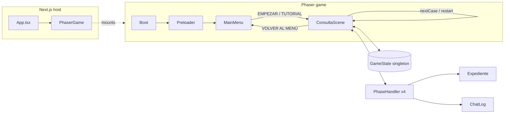
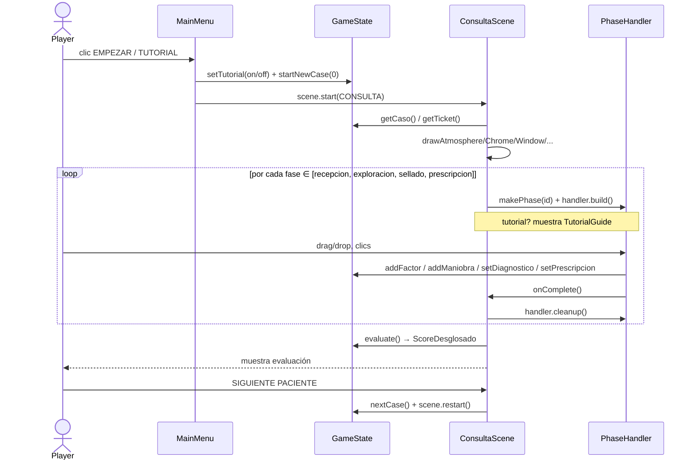
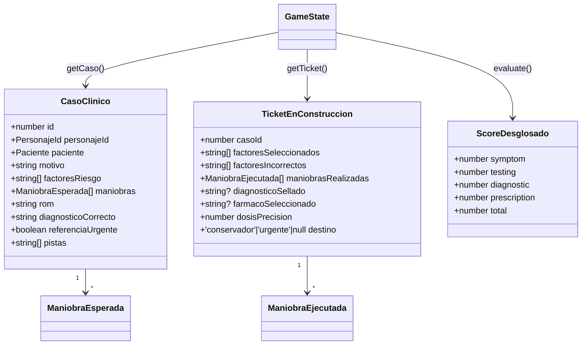
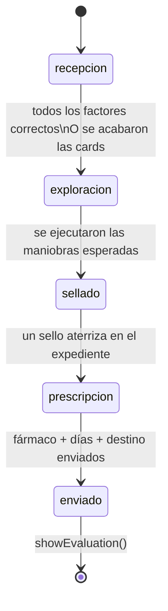
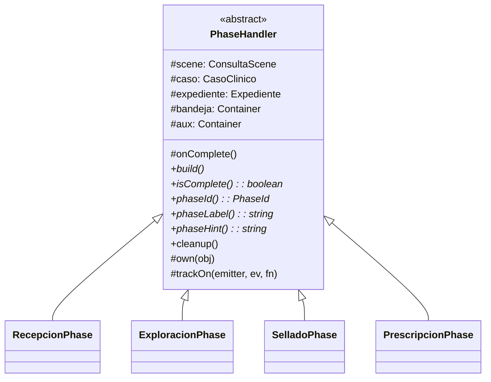
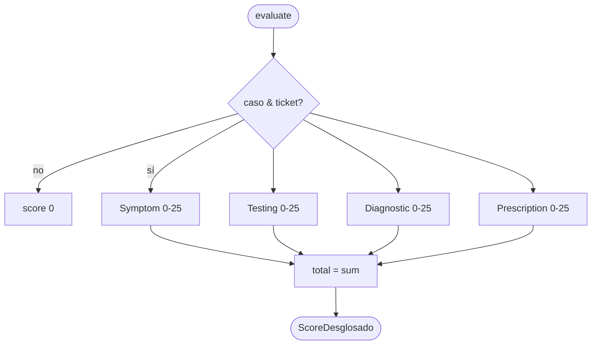
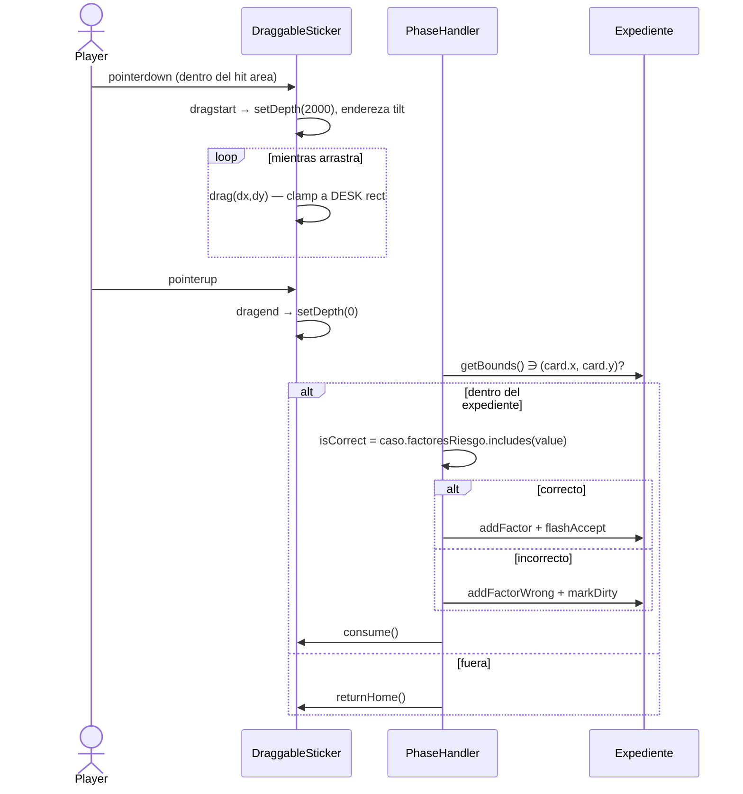
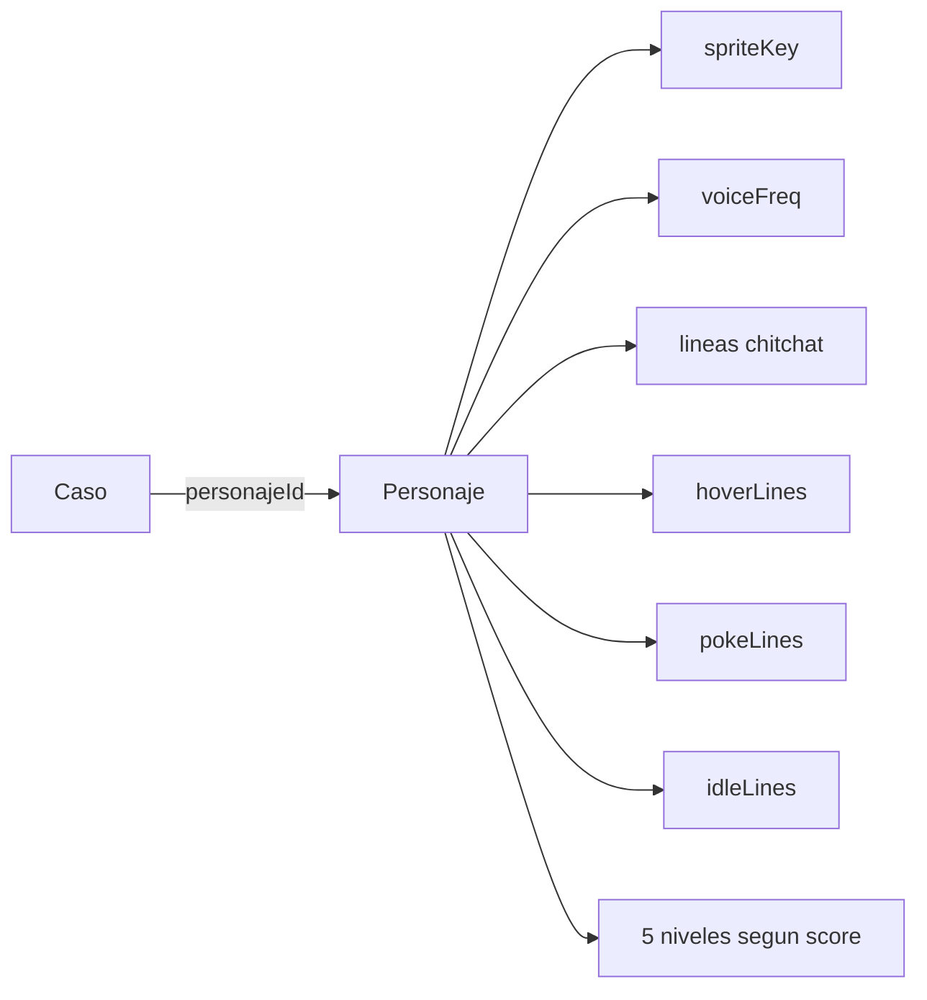

# Trauma Station — algoritmo del juego

Este documento explica cómo funciona el motor del juego por dentro:
arquitectura, ciclo de un caso clínico, las cuatro fases, el sistema de
puntuación y los modelos de datos. Los diagramas están en
[mermaid](https://mermaid.js.org/) — GitHub los renderiza en línea.

> Todo el motor vive en `src/game/`. Phaser orquesta la escena; React solo
> monta el `<canvas>`. Una sola escena (`ConsultaScene`) se reusa entre
> casos para no rebuildear el escritorio en cada paciente.

## 1. Arquitectura de alto nivel



Capas:

| Capa             | Responsabilidad                                                     |
| ---------------- | ------------------------------------------------------------------- |
| `scenes/`        | Lifecycle de Phaser (Boot → Preloader → MainMenu → ConsultaScene).  |
| `phases/`        | Una clase por fase clínica. Hereda de `PhaseHandler`.               |
| `objects/`       | UI reutilizable (`DraggableSticker`, `Expediente`, `ChatLog`, ...). |
| `state/`         | `GameState` singleton — caso activo, ticket en construcción, score. |
| `data/`          | Definiciones puras: casos clínicos, personajes, tipos.              |
| `config/`        | Tema visual y constantes globales.                                  |

## 2. Ciclo de un caso clínico



**Por qué `scene.restart()` y no `scene.start()`**: restart limpia
texturas/timers de la escena y vuelve a invocar `create()`, lo cual nos
da reset garantizado del estado por-escena (`stepIndicators`, `chatLog`,
chitchat timers, etc.). Está documentado al inicio de
`ConsultaScene.create()`.

## 3. Modelo de datos



`CasoClinico` es **inmutable** (definido en `data/casos.ts`).
`TicketEnConstruccion` es **mutable** y refleja lo que el doctor lleva
hecho. `evaluate()` los compara y produce el `ScoreDesglosado`.

## 4. Las cuatro fases



Cada fase implementa el contrato `PhaseHandler`:



| Fase            | Bandeja (izq)                                            | Aux (arriba)                | Mecánica                                                     | Fin (`isComplete`)                                |
| --------------- | -------------------------------------------------------- | --------------------------- | ------------------------------------------------------------ | ------------------------------------------------- |
| `recepcion`     | Tarjetas de factores de riesgo (correctos + distractores) | —                           | Drag de tarjeta al expediente                                | Todos los factores correctos O sin más cards      |
| `exploracion`   | Chips de maniobras                                        | Foto del hombro + zona drop | Drag al hombro, mini-juego de timing (aguja en zona verde)   | Se ejecutaron las maniobras esperadas             |
| `sellado`       | Sellos diagnósticos                                       | Negatoscopio + ROM          | Drag de UN sello al expediente                               | Hay un diagnóstico sellado (correcto o no)        |
| `prescripcion`  | Counter de días + destinos A/B                            | Cajas de fármaco            | Click fármaco, ajustar días con +/-, click destino           | Se envió a destino                                |

## 5. Pipeline de scoring (100 puntos)



### 5.1 Symptom (0-25)

```
correctos = ticket.factoresSeleccionados ∩ caso.factoresRiesgo
base      = (correctos.length / caso.factoresRiesgo.length) * 25
penalty   = ticket.factoresIncorrectos.length * 3
symptom   = max(0, base - penalty)
```

Marcar un factor incorrecto cuesta **−3 pts**. La penalización es
**permanente** dentro del caso — la card mancha el expediente y queda
contabilizada aunque luego encuentres los correctos.

### 5.2 Testing (0-25)

```
esperadas = caso.maniobras.map(id)
aciertos  = ticket.maniobrasRealizadas.filter(m =>
              esperadas.includes(m.id) && m.aciertoTiming)
testing   = (aciertos / esperadas.length) * 25
```

Hacer maniobras de más no penaliza directamente (no resta), pero
**fallar el timing** sí — esa ejecución no cuenta como acierto. Los
chips se consumen al usarlos, lo que limita el spam.

### 5.3 Diagnostic (0-25)

```
diagnostic = ticket.diagnosticoSellado === caso.diagnosticoCorrecto ? 25 : 0
```

Binario: o aciertas el diagnóstico o no. Solo puedes sellar **una vez**
(la fase se bloquea con `locked = true`).

### 5.4 Prescription (0-25)

```mermaid
flowchart LR
    days[días elegidos] --> precision{rango}
    precision -- 7-14 --> opt[1 - dist/half\n0.5 .. 1.0]
    precision -- 5-6 ó 15-18 --> mid[0.5]
    precision -- otro --> bad[0]

    dest[destino A/B] --> match{coincide con\nreferenciaUrgente?}
    match -- sí --> dOk[1]
    match -- no --> dBad[0]

    opt & mid & bad --> p
    dOk & dBad --> d
    p[dosePrecision] & d[destinoOk] --> calc[(destinoOk * 0.6 + precision * 0.4) * 25]
    calc --> rx[Prescription 0-25]
```

```
destinoOk    = ticket.destino === (caso.referenciaUrgente ? 'urgente' : 'conservador') ? 1 : 0
precision    = computePrecisionFromDays(ticket.days)   // ver tabla
prescription = (destinoOk * 0.6 + precision * 0.4) * 25
```

Tabla de `computePrecisionFromDays`:

| Rango de días               | Precision |
| --------------------------- | --------- |
| 7-14 (centro = 10.5)        | `1 - |d - 10.5| / 3.5` (0.5 .. 1.0) |
| 5-6                         | 0.5       |
| 15-18                       | 0.5       |
| Resto                       | 0         |

> El destino pesa más que la dosis (60/40) porque mandar a alguien al
> nivel equivocado tiene mayor impacto clínico que una dosis subóptima.

## 6. Drag & drop — anatomía de un pickup

Es la mecánica con más bugs históricos del juego. Vale la pena
documentarla.



Reglas que aprendimos a la mala:

1. **Hit area centrado en (0,0)**. Asimetría → la card se "agarra desde
   un lado".
2. **No usar `c.width`/`c.height` para el clamp del drag.** Después de
   `setSize(hitW, hitH)` esos valores son del hit area (visual + pad).
   Si los usas, las cards de la columna 0 saltan al recogerlas porque
   `minX > homeX`. El fix: guardar `visualHalfW = w/2` localmente.
3. **Pad moderado, no enorme.** Pad muy grande hace que hit areas
   adyacentes se traslapen y el jugador agarra la card equivocada.
   Ahora usamos `pad = 18` y bumpeamos las filas para compensar.
4. **El tilt va en el container externo, no en el visual interno.** Si
   rotas el visual, el hit area queda desalineado.
5. **Las cards viven en el scene root**, no en `bandeja`/`aux`. Phaser
   resuelve hit areas de containers anidados con bugs raros — vivir en
   el root evita eso. `PhaseHandler.own()` las trackea para el
   `cleanup()`.

## 7. Personajes y narrativa



`ConsultaScene` mezcla `caso.pistas` (líneas clínicas reales, marcadas
con ✦ en el chat log) con `personaje.chitchat` (ruido) y las dispara
cada 9-14s vía `chitchatEvent`. El jugador tiene que distinguir
entre señal y ruido leyendo la TRANSCRIPCIÓN.

## 8. Tutorial mode

```mermaid
flowchart LR
    M[MainMenu] -->|TUTORIAL| set[GameState.setTutorial true]
    set --> case[startNewCase 0 = Sans]
    case --> C[ConsultaScene]
    C -->|create| welcome[TutorialGuide bienvenida]
    welcome --> p1[recepcion + tip 01]
    p1 --> p2[exploracion + tip 02]
    p2 --> p3[sellado + tip 03]
    p3 --> p4[prescripcion + tip 04]
    p4 --> eval[showEvaluation]
    eval -->|SIGUIENTE| off[GameState.setTutorial false]
```



El flag vive en `GameState`, así que sobrevive `scene.restart()` pero
lo apagamos explícitamente al pasar al siguiente caso. La `TutorialGuide`
es modal (dim de fondo `interactive`) — bloquea input hasta que el
jugador presiona ENTENDIDO.

## 9. Glosario express

| Término       | Qué es                                                              |
| ------------- | ------------------------------------------------------------------- |
| **Bandeja**   | Container izquierdo del escritorio. Cada fase la pinta diferente.   |
| **Aux**       | Container superior izquierdo. Para imágenes (hombro, X-ray) o boxes.|
| **Expediente**| Hoja de papel a la derecha. Crece con factores, maniobras, dx, rx. |
| **ChatLog**   | Panel arriba-derecha con la transcripción. ✦ marca pistas reales.   |
| **Streak**    | Tracker de aciertos consecutivos. Detona reacción del paciente.     |
| **Pistas**    | `caso.pistas[]` — líneas relevantes mezcladas en el chitchat.       |
